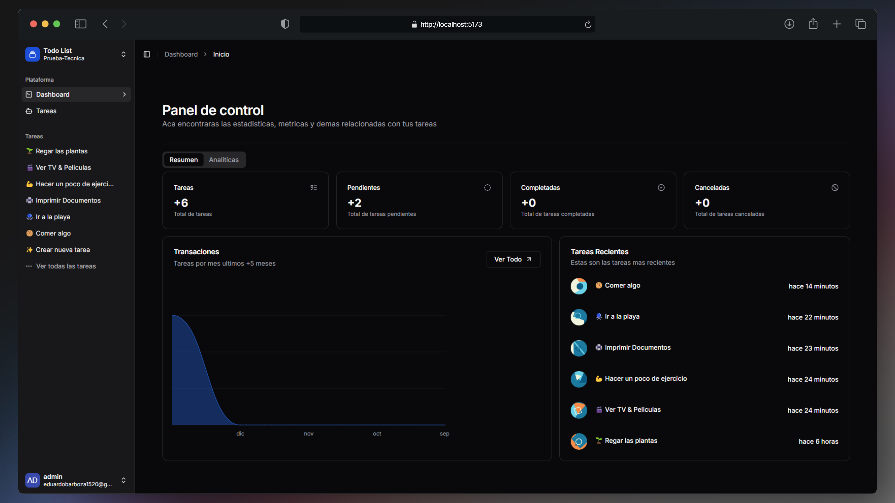

<div align="center">
<a href="https://svgl.app">

</a>
<p></p>
</div>

# Proyecto Kanban con Dashboard

Este proyecto implementa un sistema de gestión de tareas con una vista Kanban interactiva y un dashboard analítico. La estructura está dividida en dos carpetas principales:

- **server**: Contiene el backend.
- **web**: Contiene el frontend desarrollado con React y Vite.

## 🚀 Instalación

### Requisitos previos

Asegúrate de tener instalados:

- [Node.js 18+ (recomendado 20 LTS)](https://nodejs.org/en/).
- Un servidor de base de datos (MySQL, PostgreSQL o MongoDB)

### Backend (server)

1. [Fork](https://github.com/pheralb/svgl/fork) this repository and clone it locally:

2. Navega a la carpeta `server`:
   ```bash
   cd server
   ```
3. Instala las dependencias:
   ```bash
   pnpm install
   # o
   yarn install
   ```
4. Configura las variables de entorno creando un archivo `.env` en la raíz de `server`:
   ```env
   TOKEN_SECRET=<CLAVE_SECRETA_JWT>
   MONGODB_URI=<URI_DE_TU_BASE_DE_DATOS>
   FRONTEND_URL=<URL_DEL_FRONTEND>
   PORT=<PUERTO>
   ```
5. Inicia el servidor:
   ```bash
   pnpm run dev
   # o
   yarn dev
   ```

### Frontend (web)

1. Navega a la carpeta `web`:
   ```bash
   cd web
   ```
2. Instala las dependencias:
   ```bash
   pnpm install
   # o
   yarn install
   ```
3. Configura las variables de entorno creando un archivo `.env` en la raíz de `web`:
   ```env
   VITE_AUTH_URL=<URL_DE_REDIRECCIÓN_LOGIN> # Opcional
   VITE_DEFAULT_CALLBACK_URL=<URL_DE_REDIRECCIÓN_LOGIN> # Opcional
   ```

4. Configura el proxy hacia la api en el archivo `vite.config.ts` en la raíz de `web` por defecto es el puerto 8080/api:
    ```ts
    import { defineConfig } from "vite";
    import react from "@vitejs/plugin-react";
    import path from "path";

    export default defineConfig({
    plugins: [react()],
    resolve: {
    alias: {
      "@": path.resolve(__dirname, "./src"),
     },
    },
    server: {
    port: 3000,
    proxy: {
      "/api": {
        target: "http://localhost:8080/api/",
        changeOrigin: true,
        rewrite: (path) => path.replace(/^\/api/, ""),
         },
      },
     },
    });

    ```

4. Inicia la aplicación:
   ```bash
   pnpm run dev
   # o
   yarn dev
   ```

## 🌱 Funcionalidades

### Backend (server)

- **Autenticación**: Registro e inicio de sesión con JWT.
- **Gestión de tareas**:
  - Crear, listar, editar, eliminar tareas.
  - Almacenar tareas en estados (por ejemplo, Pendiente, En progreso, Completado).
- **API RESTful**:
  - Endpoints seguros con validaciones de datos.

### Frontend (web)

- **Vista Kanban**:
  - Organización de tareas en columnas según su estado.
  - Funcionalidad drag-and-drop para mover tareas entre estados.
- **Dashboard Analítico**:
  - Gráficos y métricas:
    - Total de tareas creadas.
    - Porcentaje de tareas completadas.
    - Tiempo promedio de completitud.
    - Días de mayor productividad.
    - Tareas más recurrentes por categoría.

## Explicación del Dashboard

El dashboard analítico se compone de métricas que se utilizan para analizar el comportamiento del usuario y su productividad. Estas métricas se pueden utilizar para identificar patrones y tendencias en el uso del sistema, lo que ayudará a tomar decisiones informadas y mejorar la experiencia del usuario.

Los gráficos y métricas que se utilizan en el dashboard son:

- **Número total de tareas**: Esta métrica indica el número total de tareas creadas en el sistema. Esto puede ser útil para monitorear el progreso y la eficiencia del sistema.

- **Porcentaje de tareas completadas**: Esta métrica muestra la relación entre las tareas completadas y el total de tareas. Esto puede ayudar a identificar las tareas más importantes y las tareas que se han completado con éxito.

- **Total de tareas por status (todo, pendiente, en progreso, completado)**: Esta métrica muestra el número total de tareas en cada estado.

- **Grafico de tareas ultimos 5 meses**: Este gráfico muestra la cantidad de tareas completadas en los últimos 5 meses. Esto puede ayudar a identificar patrones y tendencias en el uso del sistema.

- **Tabla de tareas creadas recientes**: Esta tabla muestra las tareas creadas recientemente en el sistema. Esto puede ser útil para monitorear el progreso y la eficiencia .

- **Grafico de tareas completadas por semana**: Este gráfico muestra la cantidad de tareas completadas en cada semana. Esto puede ayudar a identificar patrones y tendencias en el uso del sistema e identificar días de mayor productividad.

- **Porcentaje de eficiencia**: Esta métrica muestra el porcentaje de tareas completadas en relación con el número total de tareas. Esto ayuda a identificar que tan en cumplir con las tareas pendientes.

- **Promedio de tareas por dia**: Esta metrica muestra el promedio de tareas que se crean por día. Esto puede ayudar a identificar patrones y tendencias de uso.


## Estructura del Proyecto

```
kanban-project/
├── server/        # Backend
│   ├── src/
│   ├── .env       # Variables de entorno
│   ├── package.json
│   └── ...
├── web/           # Frontend
│   ├── src/
│   ├── .env       # Variables de entorno
│   ├── package.json
│   └── ...
└── README.md
```

## Uso

1. Registra un usuario e inicia sesión.
2. Crea, edita, organiza y elimina tareas en la vista Kanban.
3. Consulta el dashboard para analizar tu productividad.

## 🛠️ Tecnologías Utilizadas

- **Frontend**: React, Vite, TailwindCSS, Axios,TypeScript.
- **Backend**: Node.js, Express,Zod.
- **Base de Datos**: MySQL/PostgreSQL/MongoDB.
- **Autenticación**: JSON Web Tokens (JWT).
- **Gráficos**: Recharts.

## ✌️ Contribución

Si deseas contribuir:

1. Haz un fork del proyecto.
2. Crea una nueva rama para tus cambios.
   ```bash
   git checkout -b feature/nueva-funcionalidad
   ```
3. Realiza tus cambios y haz commit.
   ```bash
   git commit -m "Añadida nueva funcionalidad"
   ```
4. Envía un pull request.

## Licencia

Este proyecto está bajo la Licencia MIT. Consulta el archivo `LICENSE` para más detalles.
